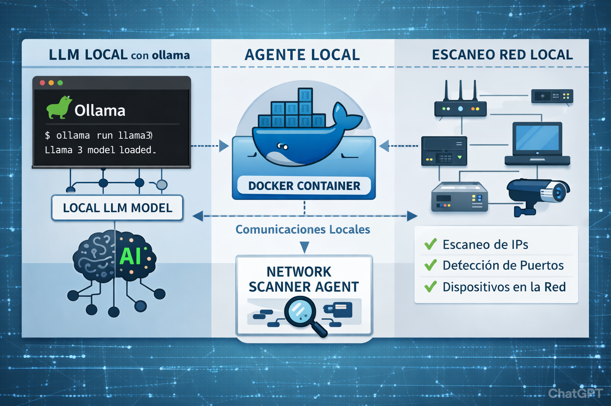

# Autonomous Pentesting Agents with Local LLMs

Welcome to this course on building your own **autonomous security‑testing agent** powered by a **local Large Language Model (LLM)**.  
The goal of this project is to teach you how to design, train, deploy, and run an autonomous agent capable of performing controlled pentesting tasks while maintaining full data privacy and offline execution.

---

## Introduction

Autonomous agents are systems capable of making decisions, planning actions, and executing tasks without continuous human intervention. When combined with a **local LLM**, these agents can analyze environments, generate hypotheses, execute commands, and iterate on results in a closed feedback loop.

This course focuses on a **single‑connection architecture**, where the agent interacts with a **local LLM running on Ollama**. This architecture ensures:

- Full data privacy (no external API calls)  
- Low latency  
- High control over model behavior  
- Reproducible and isolated execution  
- Compatibility with containerized environments (Docker)  

The agent runs inside a **Docker container**, while the LLM runs locally on the host machine through Ollama. The agent communicates with the LLM through a single HTTP endpoint, and can **execute OS commands and actions instructed by the LLM**, closing the loop between reasoning and real system interaction.

---

## Architecture Diagram

## Index content

### 📂 1. Fundamentals & Environment Setup
* [**1.1 Installing Ollama on Linux**](./install-ollama-linux.md)
    * *Setting up the backend engine for local LLM execution.*
* [**1.2 Searching for Local Models**](./search-local-models.md)
    * *Selection criteria for base models (Qwen, Llama, etc.).*
* [**1.3 Running the Model on a Local Web Interface**](./run-model-web.md)

---

### 🧠 2. Training Lifecycle (Fine-Tuning)
* **2.1 Mission Design**
    * [Defining the Agent’s Objective](./agent-objective.md) — *System prompts and scope.*
* **2.2 Data Engineering**
    * [Creating the Dataset](./dataset-creation.md) — *Cleaning and formatting instructions in JSONL.*
* **2.3 Training & Optimization**
    * [Training the Model](./model-training.md) — *Using Unsloth and hyperparameter tuning.*
    * [Creating and Running the Model in Ollama](./ollama-custom-model.md) — *GGUF conversion and Modelfile setup.*

---

### 📦 3. Deployment & Runtime Environment
* [**3.1 Building the Agent Inside a Docker Image**](./docker-agent.md)

---

### 🛠️ 4. Quality Assurance & Refinement
* [**4.1 Testing, Execution, and Improvements**](./testing-and-improvements.md)
    * *Validating generated Nmap commands and fixing hallucinations.*

---