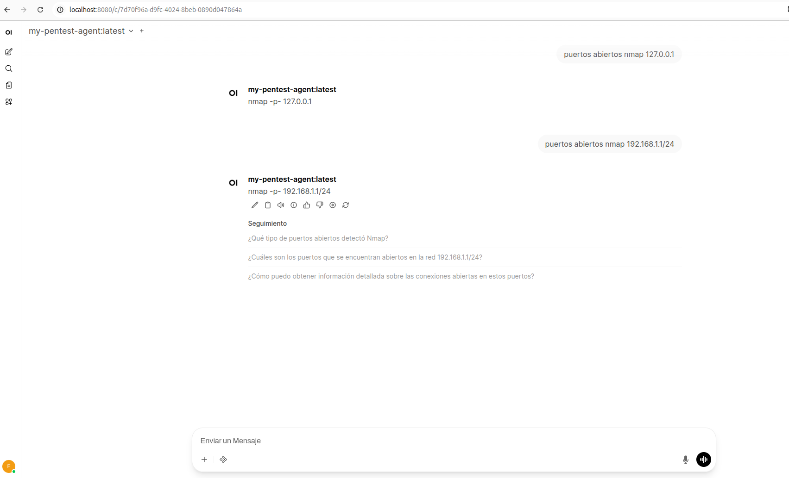

# Creating and Running the Model in Ollama

In this chapter, you will create a custom model configuration for Ollama and run it as the LLM backend for your agent.


## Example: Creating a Model Wrapper in Ollama

Even if you fine‑tune externally, you typically wrap the resulting model in an Ollama `Modelfile`:


Modelfile
```bash
FROM ./<trained model name .gguf>

# Aumentamos la penalización para que no se repita y forzamos a mirar más tokens
PARAMETER temperature 0.1
PARAMETER top_p 0.4
PARAMETER stop "### Instrucción:"
PARAMETER stop "### Respuesta:"

TEMPLATE """### Instrucción:
{{ .Prompt }}

### Respuesta:
"""

PARAMETER stop "### Instrucción:"
PARAMETER stop "### Respuesta:"


SYSTEM """Eres un experto en Nmap (v7.94+).
- OBJETIVOS: Usa <ip> para hosts únicos y <ip>/<mask> para redes.
- PUERTOS: Usa <port> para puertos específicos y -p- para todos.
- CATEGORÍAS:
  * Si piden sigilo: Usa -T0 o -T1.
  * Si piden evasión: Usa -f, -Pn o -D.
  * Si piden agresividad: Usa -A o -T4.
- No inventes direcciones IP reales, cíñete a los marcadores."""
```


```bash
ollama create my-pentest-agent -f Modelfile
gathering model components 
copying file sha256:d516eb0a42bd0c49e2d95b097f13d6a75b30810645f9825fe059052b32dced80 100% 
parsing GGUF 
using existing layer sha256:d516eb0a42bd0c49e2d95b097f13d6a75b30810645f9825fe059052b32dced80 
using existing layer sha256:881e60f859d476a4c4e0cb3adb84bc49bdc280f912de77f17771b1ae203af180 
creating new layer sha256:c368e6fe5ca385856b16d8ec710b09bae546317c611c551627aff8d384274003 
using existing layer sha256:f037561273cf72ee0e8515c9bc687616804733fc521d490e5ebd7aa64a32e6ed 
writing manifest 
success
```

## Run your custom model example

```bash
ollama list | grep pentest
my-pentest-agent:latest                        88ea426aba02    986 MB    26 seconds ago

ollama run my-pentest-agent:latest
>>> Nmap example 127.0.0.1
nmap -sV 127.0.0.1

>>> nmap localhost
nmap -sV localhost

```
## Using openweb-ui




---

[back](./)
