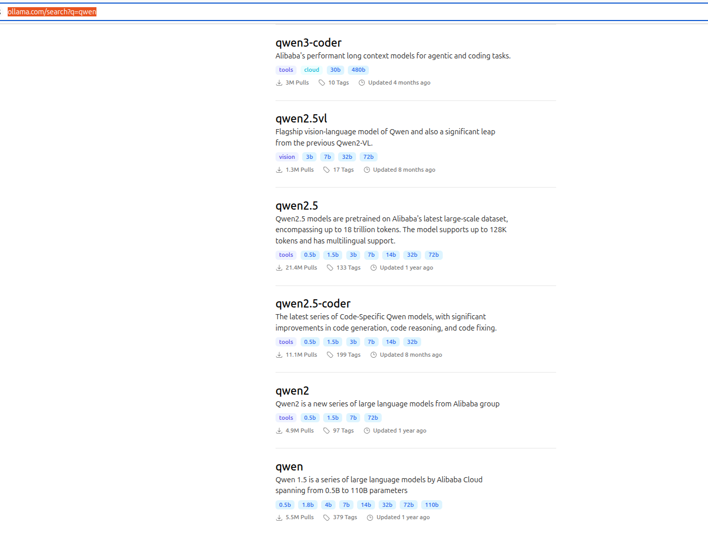
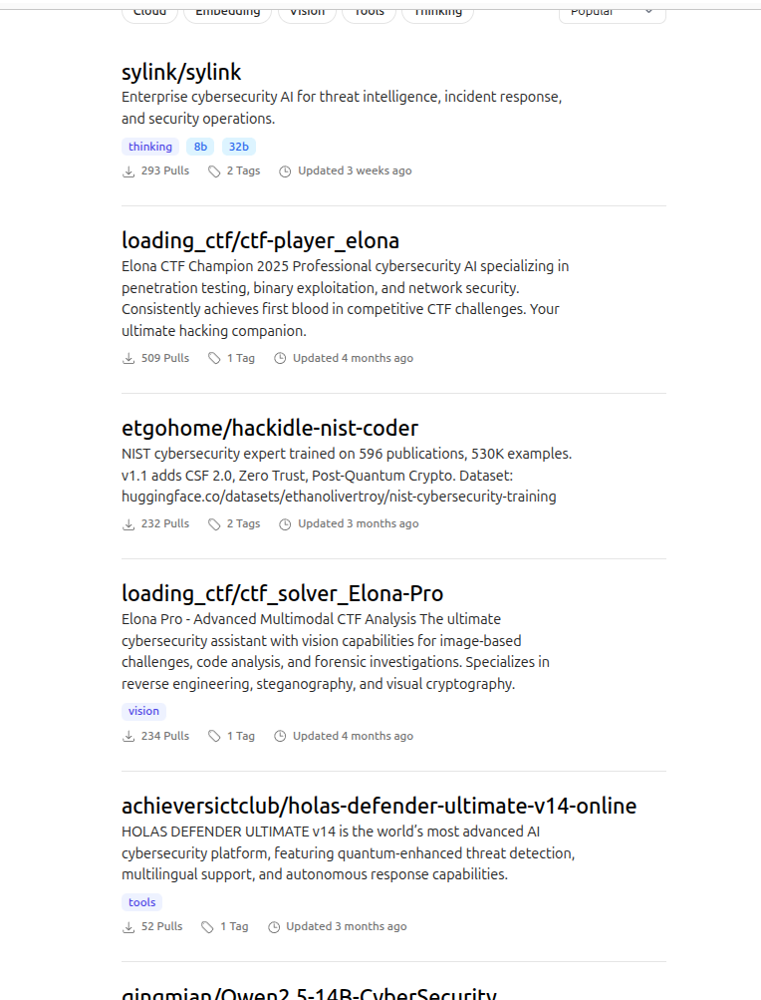

# Searching for Local Models


The basic idea of ​​the course is to use and train a local LLM model.
Ollama supports a multitude of models, which can be found on the official website, of different sizes and qualities, which may or may not suit your needs or the capabilities of your machine.

## Catalog
https://ollama.com/library

Model types:
    -  General‑purpose LLMs

    - Code‑oriented models

    - Lightweight models

    - Instruction‑tuned models

The smartest thing is to look for a basic LLM model that has as its only specific capability or skill the ability to converse.

The benefits will be:
- Fast mode and small size
- Your graphics card will be able to train it

For the course, we will be able to find models in their versions from 1 to 3 from 0.5 bin. They are extremely small, lightweight, and fast models.

https://ollama.com/search?q=qwen





### If you look for an already local trained cybersecurity models

https://ollama.com/search?page=2&q=cybersecurity 




## Download and install an existing model

```bash
llama pull qwen3:0.6b
pulling manifest 
pulling 7f4030143c1c: 100% ▕█████████████████████████████████████████████████████████████████████▏ 522 MB                         
pulling ae370d884f10: 100% ▕█████████████████████████████████████████████████████████████████████▏ 1.7 KB                         
pulling d18a5cc71b84: 100% ▕█████████████████████████████████████████████████████████████████████▏  11 KB                         
pulling cff3f395ef37: 100% ▕█████████████████████████████████████████████████████████████████████▏  120 B                         
pulling b0830f4ff6a0: 100% ▕█████████████████████████████████████████████████████████████████████▏  490 B                         
verifying sha256 digest 
writing manifest 
success 

```

## Listing Installed Models

To see which models are already installed:

```bash
ollama list
NAME                                           ID              SIZE      MODIFIED       
qwen3:0.6b                                     7df6b6e09427    522 MB    46 seconds ago    
```

[back](./)