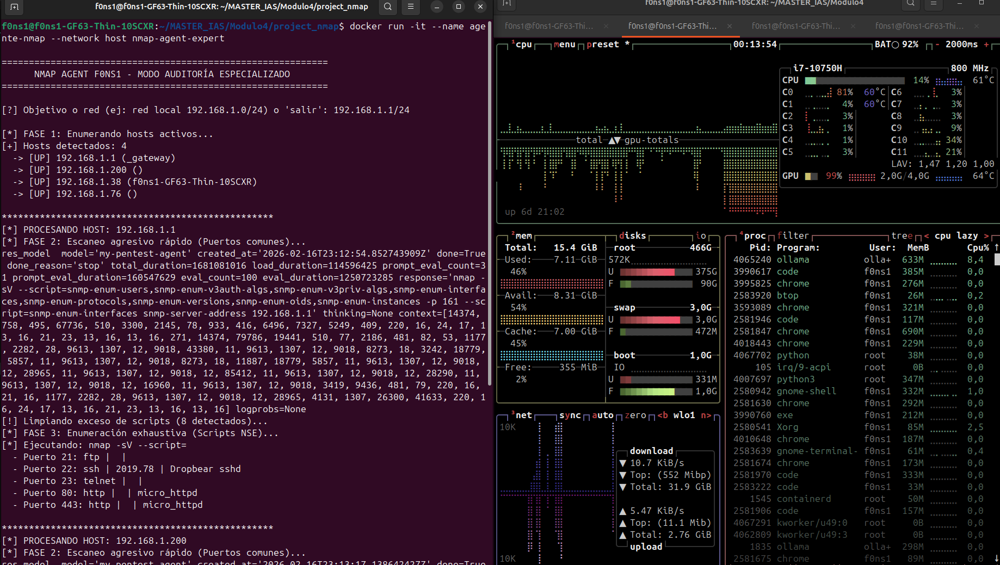

# Docker agent execution

```bash
docker run -it --name agente-nmap --network host nmap-agent-expert

============================================================
      NMAP AGENT F0NS1 - MODO AUDITORÍA ESPECIALIZADO
============================================================

[?] Objetivo o red (ej: red local 192.168.1.0/24) o 'salir': 192.168.1.1/24

[*] FASE 1: Enumerando hosts activos...
[+] Hosts detectados: 4
  -> [UP] 192.168.1.1 (_gateway)
  -> [UP] 192.168.1.200 ()
  -> [UP] 192.168.1.38 (f0ns1-GF63-Thin-10SCXR)
  -> [UP] 192.168.1.76 ()

**************************************************
[*] PROCESANDO HOST: 192.168.1.1
[*] FASE 2: Escaneo agresivo rápido (Puertos comunes)...

```



It is normal for the agent not to work well at first. 

It is possible that the training needs to be modified due to statistical or stochastic issues like overfitting or underfitting.

The model may collapse after extensive training and forget previous knowledge.

The key is in the dataset: 
- **How normalized it is**
- **How rich and precise it is**
- **The length or number of entries**

In the training process, the keys are:
- **per_device_train_batch_size:** This is the number of training examples processed by the GPU in a single forward and backward pass. 
- **gradient_accumulation_steps:** This is a clever technique to simulate a larger Batch Size without needing more VRAM. Instead of updating the model's weights after every single batch, the model "accumulates" the gradients over several steps and then performs one update. 
- **num_train_epochs:** An Epoch represents one full pass of the entire training dataset through the model. 
- **learning_rate:** This determines the "step size" the optimizer takes while moving toward a lower loss (better accuracy). 

---

[back](./)